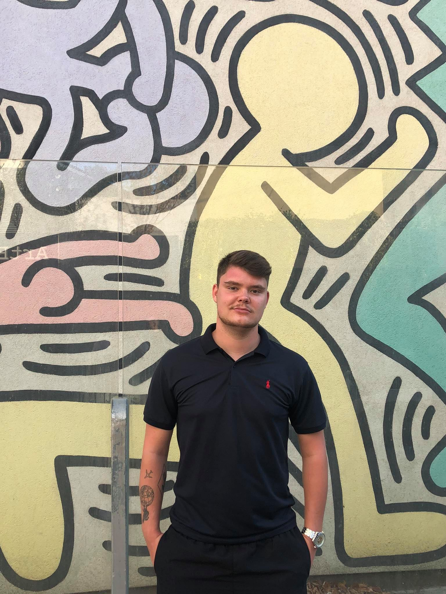

# Project Cordova 2021 - 2022

- **Name**: Bryan Van Herck
- **Class**: (2APPAI 01)
- **Email**: <a href="mailto:r0714517@student.thomasmore.be">r0714517@student.thomasmore.be</a>
- **Student number**: r0714517
- **APK download URL**: ......

## Short description of your app

De homepagina bestaat uit algemene info over mezelf en wat meer info over de app zelf.
Op de 2e pagina vind u een camera. U kan zelf een foto nemen of een bestand uploaden vanuit uw galerij.
Als u een foto zelf maakt, zal deze ook automatisch opgeslagen worden in uw galerij.
U kan ook de foto die u heeft genomen, bekijken via de app.
Op de 3e tab vind u een data overzicht van de Engelse voetbalcompetitie.
Dit is van het huidige seizoen.
Hier zal men bijvoorbeeld kunnen raadplegen wie de speler is met de meeste goals, de speler met de meeste assists, etc.
De 4e tab bevat een local storage. 
Hier kan de gebruiker zelf de uitslag voorspellen van wedstrijden.
De voorspellingen kan de gebruiker raadplegen in een overzicht nadat hij deze heeft toegevoegd.

## Plugins used

- [cordova-plugin-whitelist](https://cordova.apache.org/docs/en/latest/reference/cordova-plugin-whitelist/)  
Used for ...

## Tip: GitHub Markdown
[Basic writing and formatting Markdown syntax](https://docs.github.com/en/github/writing-on-github/basic-writing-and-formatting-syntax)
